# 1. ELK 스택란?

“ELK”는 Elasticsearch, Logstash 및 Kibana, 이 오픈 소스 프로젝트 세 개의 머리글자입니다.

- Elasticsearch : 검색 및 분석 엔진

- Logstash : 여러 소스에 동시에 데이터를 수집하여 변환한 후 Elasticsearch 같은 “stash”로 전송하는 서버 사이드 데이터 처리 파이프라인

- Kibana : 사용자가 Elasticsearch에서 차트와 그래프를 이용해 데이터를 시각화

<br><br>

# 2. Elastic Search

## 2-1. Elastic Search란?

- 확장성이 뛰어난 오픈 소스 전체 텍스트 검색 및 분석 엔진

- 대량의 데이터를 신속하고 거의 실시간으로 저장, 검색 및 분석

- 일반적으로 복잡한 검색 기능과 요구 사항이 있는 응용 프로그램을 구동하는 기본 엔진 / 기술

<br>

## 2-2. 핵심 개념

- Near Realtime (NRT)
    - Elastic Search는 거의 실시간 검색 플랫폼
    - 문서를 색인할 때부터 검색 기능할 때까지 약간의 대기시간(일반적으로 1초)이 매우 짧음

- 클러스터(Cluster)
    - 전체 데이터를 함께 보유하고 모든 노드에서 연합 인덱싱 및 검색 기능을 제공하는 하나 이상의 노드(서버) 모음 -> 노드의 그룹이라고 생각
    - 클러스터는 기본적으로 elasticsearch 라는 고유한 이름으로 식별
    - 이 이름은 노드가 이름으로 클러스터에 참여하도록 설정된 경우 노드가 클러스터의 일부일 수 있기 때문에 중요

- 노드(Node)
    - 노드는 클러스터의 일부이며 데이터를 저장하고 클러스터의 인덱싱 및 검색 기능에 참여하는 단일 서버
    - 단일 클러스터에서 원하는 만큼 노드를 소유 가능
    - 현재 네트워크에서 실행중인 다른 Elasticsearch 노드가 없는 경우 단일 노드를 시작하면 기본적으로 elaticsearch라는 새로운 단일 노드 클러스터가 생성

- 색인(index)
    - 색인은 다소 유사한 특성을 갖는 문서의 컬렉션
    - 색인은 이름(모두 소문자여야함)으로 식별되며 이 이름은 색인 작성, 검색, 갱신 및 삭제할 때 색인을 참조하는데 사용
    - RDB 관점에서 보면 DB에 해당

- Type
    - 다른 종류의 data들을 같은 index에 저장하게 해주는 index의 ‘논리적인’ 부분을 의미
    - 7.x 버전부터 해당 개념이 전체 삭제 -> deprecated
    - RDB 관점에서 보면 Table에 해당

- Documments
    - 문서는 색인을 생성할 수 있는 기본 정보 단위
    - JSON으로 표현
    - RDB 관점에서 Record

<br>

## 2-3. 설치

- Ubuntu server 20.04 LTS 로 진행하겠습니다. ELK 버전은 7.14.1 으로 진행하겠습니다. 버전이 달라지면서 차이가 있으니 url 정보를 참고하도록 합니다.

- ELK 모두 설치하도록 하겠습니다. 아래서는 자바를 설치했으나 엘라스틱서치를 설치하면 같이 JDK가 설치되므로 JAVA를 따로 설치하지 않아도 됩니다.

```linux
# ec2 접속 및 업데이트

# 접속
ssh -i pem키 ubuntu@ip주소

# 업데이트
sudo apt-get update 
sudo apt-get upgrade -y

## 업데이트 완료 ##

## 편의를 위해 네트워크 명령줄 도구 설치 ##
sudo apt-get install net-tools

## elasticsearch가 java 기반이므로 java 설치 ##
# java 설치
sudo apt-get install openjdk-11-jdk -y

# 환경 변수 설정
vim ~/.bashrc

# 맨 아래 삽입
export JAVA_HOME=$(dirname $(dirname $(readlink -f $(which java))))
export PATH=$PATH:$JAVA_HOME/bin

# 변경사항 적용
source ~/.bashrc

# 적용 확인 -> /usr/lib/jvm/java-11-openjdk-amd64 출력시 정상
echo $JAVA_HOME

## ELK 다운 ##
# elastic stack
wget https://artifacts.elastic.co/downloads/elasticsearch/elasticsearch-7.14.1-amd64.deb

# 키바나 
wget https://artifacts.elastic.co/downloads/kibana/kibana-7.14.1-amd64.deb

# logstash
wget https://artifacts.elastic.co/downloads/logstash/logstash-7.14.1-amd64.deb

# filebeat
wget https://artifacts.elastic.co/downloads/beats/filebeat/filebeat-7.14.1-amd64.deb

## ELK 설치 ##
# elastic search
sudo dpkg -i elasticsearch-7.14.1-amd64.deb

# 키바나
sudo dpkg -i kibana-7.14.1-amd64.deb

# logstash
sudo dpkg -i logstash-7.14.1-amd64.deb

# filebeat
sudo dpkg -i filebeat-7.14.1-amd64.deb

# 실행 # -> 초기 수행시 시간이 조금 걸립니다.
sudo service elasticsearch start

# 상태 확인 -> active (running) 상태이면 정상 동작
service elasticsearch status

sudo service kibana start
service kibana status
```

<br>

### 2-3-1. 패키지로 설치시 경로

- 실행 파일 경로 : /usr/share/elasticsearch

- 로그 경로 : /var/log/elasticsearch

- 시스템 설정 파일 경로 : /etc/default/elasticsearch

- 설정 경로 : /etc/elasticsearch

- 데이터 저장 경로 : /var/lib/elasticsearch

elasticsearch 기준으로 작성하였으나 다른 것들도 마찬가지입니다.

<br>

### 2-3-2. 외부접속 허용

- Elasticsearch는 기본적으로 설치된 서버에서만 통신이 가능하게 설정이 되어있습니다. 외부접속을 허용하기 위해서는 추가적으로 설정이 필요합니다. network.host는 수정이 필요하고 cluster부분은 주석을 제거해줍니다.

```linux
## Elasticsearch 외부 접속 허용 ##
# 수정
sudo vi /etc/elasticsearch/elasticsearch.yml
network.host: 0.0.0.0
cluster.initial_master_nodes: ["node-1", "node-2"]

# 재시작
sudo service elasticsearch restart

## 키바나 외부 접속 허용##
# 수정
sudo vim /etc/kibana/kibana.yml
server.host: "0.0.0.0"

# 재시작
sudo service kibana restart
```

<br>

## 2-4. Elasticsearch CRUD

### 2-4-1. 클러스터 상태 (Health)

- 클러스터가 어떻게 진행되고 있는지 기본적인 확인

- 클러스터 상태를 확인하기 위해 _cat API를 사용

- curl를 사용하여 수행 가능 -> 노드 정보: GET /_cat/nodes?v 상태 정보 : GET /_cat/health?v
    - Elasticsearch에서 _언더바가 붙은 것들이 API
    - v는 상세하게 보여달라는 의미

- 녹색 : 모든 것이 정상 동작

- 노란색 : 모든 데이터를 사용 가능하지만 일부 복제본은 아직 할당되지 않음(클러스터는 완전히 동작)

- 빨간색 : 어떤 이유로든 일부 데이터를 사용 불가능(클러스터가 부분적으로만 동작)

<br>

### 2-4-2. 데이터베이스(index)가 가진 데이터 확인하기

- index는 일반 RDB에서의 DB 역할

- 모든 인덱스 항목을 조회

- GET /_cat/indices?v

[그림1 - 데이터 구조]

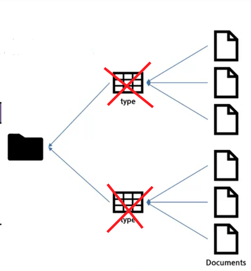

- 인덱스와 도큐먼트의 단위로 구성 (타입은 deprecated)

- 도큐먼트는 엘라스틱서치의 데이터가 저장되는 최소 단위

- 여러 개의 도큐먼트가 하나의 인덱스를 구성

<br>

### 2-4-3. 데이터 입력/조회/삭제/업데이트

- 입력 : PUT
    - ip:9200/index1/type1/1 -d ‘{“num”:1,”name:”test”}’

- 조회 : GET
    - ip:9200/index1/type1/1

- 삭제 : DELETE
    - ip:9200/index1/type1/1

- 업데이트 : POST
    - ip:9200/index1/type1/1_update -d ‘{doc: {“age”:99}}’

- 7버전부터는 PUT과 POST 혼용 가능

<br>

### 2-4-4. 실습

IP:5601 으로 키비나에 접속한 후 왼쪽 탭에서 Devtools 탭을 클릭하여 테스트해 볼 수 있습니다.

```kibana
# index와 doc 만들기
# customer 는 인덱스명, 1은 doc의 id
# 참고로 맨 앞에 / 는 안 붙여도 됩니다.
POST /customer/_doc/1
{
  "name":"choi",
  "age":25
}

# _update로 수정하기
POST /customer/_doc/1/_update
{
  "doc": {
    "name":"change"
  }
}

# script 사용
POST /customer/_doc/1/_update
{
  "script" : {
    "inline": "if(ctx._source.age==25) {ctx._source.age++}"
  }
}

# 조회하기
GET /customer/_doc/1

# 삭제하기
DELETE /customer
```

<br>

### 2-4-5. 배치 프로세스

- 작업을 일괄적으로 수행할 수 있는 기능

- 최대한 적은 네트워크 왕복으로 가능한 빨리 여러 작업을 수행할 수 있는 효율적인 매커니즘

- 하나의 행동이 실패하면, 그 행동의 나머지는 행동을 계속해서 처리

- API가 반환되면 각 액션에 대한 상태가 전송된 순서대로 제공되므로 특정 액션이 실패했는지 여부를 확인 가능

```kibana
## 키바나의 Devtools에서 진행 ##

# 벌크 저장
POST /customer/_bulk
{"index":{"_id":"1"}}
{"name":"choi"}
{"index":{"_id":"2"}}
{"name":"kim"}

# 조회
GET /customer/_doc/1
GET /customer/_doc/2

# 수정 및 삭제
POST /customer/_bulk
{"update":{"_id":"1"}}
{"doc":{"age":18}}
{"delete":{"_id":"2"}}

# 조회
GET /customer/_doc/1
GET /customer/_doc/2
```

<br>

### 2-4-6. 검색 API

검색을 실행하는 기본적인 두 가지 방법이 있습니다.

- REST 요청 URI를 통해 검색 매개 변수를 보내기

- REST 요청 본문을 통해 검색 매개 변수 보내기

검색용 REST API는 _search 엔드 포인트에서 액세스할 수 있습니다.

#### URI를 통해 검색하기

```
GET /bank/_search?q=*&sort=account_number:asc&pretty
```

- bank 인덱스

- q=* : q는 쿼리, *는 모든것을 의미 -> 인덱스의 모든 문서를 검색을 지시한 것, 특정 단어 검색을 원한다면 특정 단어를 명시

- sort : 정렬

- asc : 오름차순

- pretty : 이쁘게 출력

[그림2 - 검색 결과]
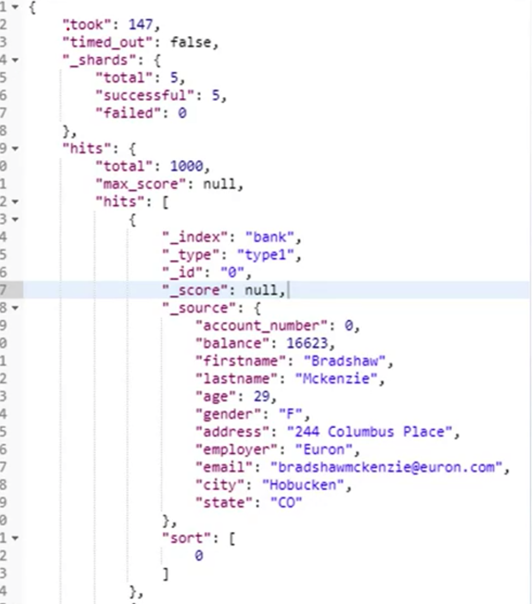


- took : 검색하는데 걸린 시간 (밀리 초)

- timed_out : 검색 시간이 초과되었는지 여부 알림

- _shards : 검색된 파편의 수와 성공/실패한 파편의 수를 알림

- hits : 검색 결과

- hits.total : 검색 조건과 일치하는 총 문서 수

- max_score : 가장 높은 점수를 취득한 doc 를 명시, null의 경우 없다는 뜻

- hits.hits : 검색 결과의 실제 배열(기본값은 처음 10개)

- hits.sort : 결과 정렬키


#### 예시

```
# 전체 인덱스의 title필드에서 time검색
/_search?q=title:time

# 다중 조건 검색 -> and 또는 or
/_search?q=title:time AND machine

# 점수 계산에서 사용된 상세값 출력
/_search?q=title:time&explain

# doc 출력 생략
/_search?q=title:time&_source=false

# 특정 source 출력
/_search?q=title:time&_source=title,author

# 정렬
/_search?q=title:time&sort=pages
/_search?q=title:time&sort=pages:desc
```

### 2-4-7. 본문을 통해 검색하기 - Query DSL

Elasticsearch에서 쿼리를 실행하는데 사용할 수 있는 JSON 스타일 도메인 관련 언어입니다. URI에 q=* 대신 JSON 스타일 쿼리 요청 본문을 제공하면 됩니다.

```
# match_all 쿼리는 지정된 색인의 모든 문서를 검색
POST /bank/_search
{
    "query": {"match_all": {}}    
}

# 1개만 조회
# size dafult = 10
POST /bank/_search
{
    "query": {"match_all": {}},
    "size":1
}

# from 매개변수에서 시작하여 size만큼의 문서를 반환
# 즉, 10 ~ 19 까지
# from default = 0
POST /bank/_search
{
    "query": {"match_all": {}},
    "from": 10,
    "size": 10
}

# balance 필드 기준 내림차순 정렬하고 상위 10개
POST /bank/_search
{
    "query": {"match_all": {}},
    "sort": {"balance":{"order":"desc"}
}

# 특정 필드만 출력
POST /bank/_search
{
    "query": {"match_all": {}},
    "_source": ["account_number","balance"]
}

# address가 mail lain인 것을 반환
# 일치순으로 나옴 -> mail lane, mail, lane 이런 식
POST /bank/_search
{
    "query": {"match": {"address": "mail lane"}}
}

# address가 mail lain과 완벽 일치 반환
POST /bank/_search
{
    "query": {"match_phrase": {"address": "mail lane"}}
}

# address가 maill과 lane을 포함하는 모든 계정 반환
POST /bank/_search
{
    "query": {
        "bool": {
            "must": [
                {"match": {"address": "mill"}},
                {"match": {"address": "lane"}}
            ]
        }
    }
}

# mill은 포함하지만 lane은 포함하지 않는 모든 계정 반환
POST /bank/_search
{
    "query": {
        "bool": {
            "must": [
                {"match": {"address": "mill"}},               
            ],
            "must_not": [
                {"match": {"address": "lane"}}
            ]
        }
    }
}
```

<br><br>

# 3. Kibana

## 3-1. Kibana란?

- Elasticsearch와 함께 작동하도록 설계된 오픈 소스 분석 및 시각화 플랫폼

- Elasticsearch 색인에 저장된 데이터를 검색, 보기 및 상호 작용

- 고급 데이터 분석을 쉽게 수행하고 다양한 차트, 테이블, 맵에서 데이터를 시각화

- 간단한 브라우저 기반의 인터페이스를 통해 실시간으로 Elasticsearch 쿼리의 변경 사항을 표시하는 동적 대시보드를 신속하게 만들고 공유

<br>

## 3-2. Kibana 시각화 준비하기

데이터를 만들면(로그를 수집하면) Kibana의 index pattern애 자동으로 등록되지 않습니다. 따라서 수동으로 등록하는 작업을 해야합니다. 인덱스 패턴을 등록하는 작업을 해보겠습니다.


1.  Stack Management 호출

[그림3 -  Stack Management 호출]
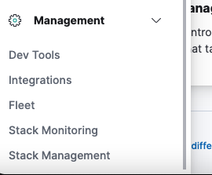

IP:5601 로 키바나에 접속한 다음 왼쪽 탭의 최하단에 있는 Stack Management를 클릭합니다.

<br>

2. Create Index Pattern 선택

[그림4 - Create Index Pattern 선택]

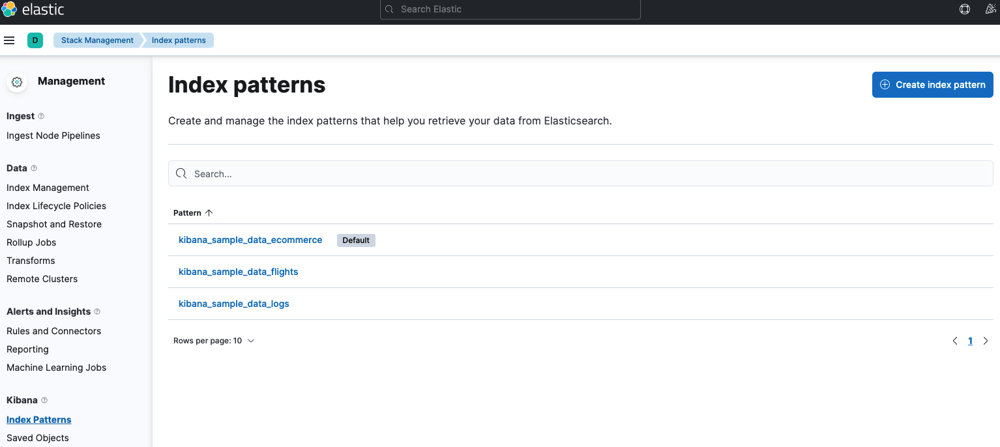


왼쪽 탭에서 Kibana -> Index Patterns 를 클릭하고 오른쪽 상단에 Create Index Pattern을 클릭합니다.

<br>

3. Index의 패턴 검색

[그림5 - Index의 패턴 검색]


Index의 패턴을 검색해줍니다. logstash를 사용했다면 logstash- 형태의 패턴입니다. 저는 tourcompany index를 등록하겠습니다.

<br>

4. 메인 시간 데이터 필드 등록

[그림6 - 메인 시간 데이터 필드 등록]

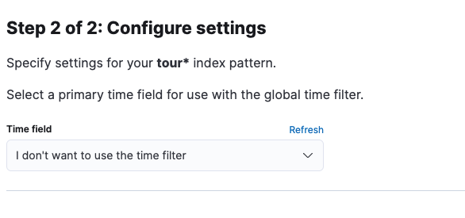

메인 시간 데이터 필드를 등록해줍니다. 없다면 I don’t want to user the Time Filter을 선택하면 됩니다. 이렇게 패턴을 만든 후에야 분석이 가능합니다.

<br>

5. Index의 패턴 확인

[그림7 - Index의 패턴 확인]


이제 다시 메인의 왼쪽 탭에서 Analytics 의 Discover을 보면 방금 만든 Index 패턴을 확인할 수 있습니다.

<br>

## 3-3. 시각화하기

앞선 준비하기에서는 어떻게 Index에 등록해서 시각화 준비를 하는지 알아봤습니다. 제가 등록한 Index에는 데이터가 너무 적기 때문에 Kibana에서 제공하는 Sample 데이터를 이용해서 시각화 해보겠습니다.

[그림8 - data 추가]


키바나 메인페이지에서 하단에 Add data를 클릭합니다.


[그림9 - Sample flight data 등록]


Sample flight data를 등록해줍니다.


[그림10 - Dashboard 생성]
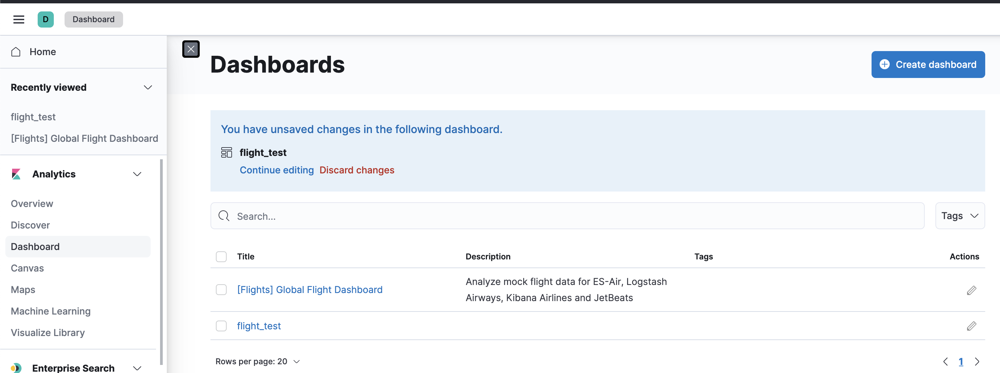 


왼쪽 탭에서 Dashboard를 클릭하고 우측 상단에 Create Dashboard를 클릭합니다.


[그림11 - visualization 생성] 
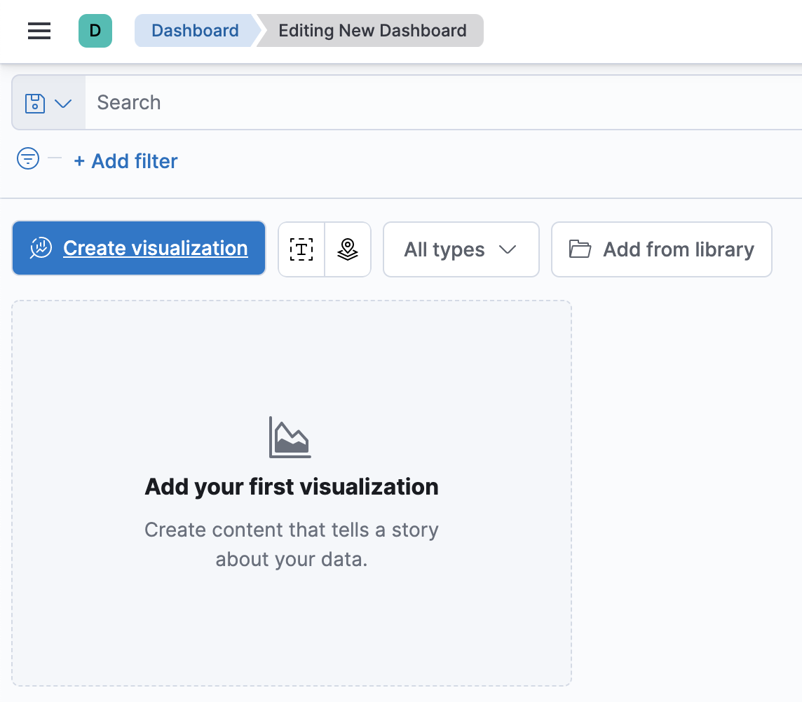

Create visualization을 클릭해줍니다.


[그림12 - 시각화 필드 선택]
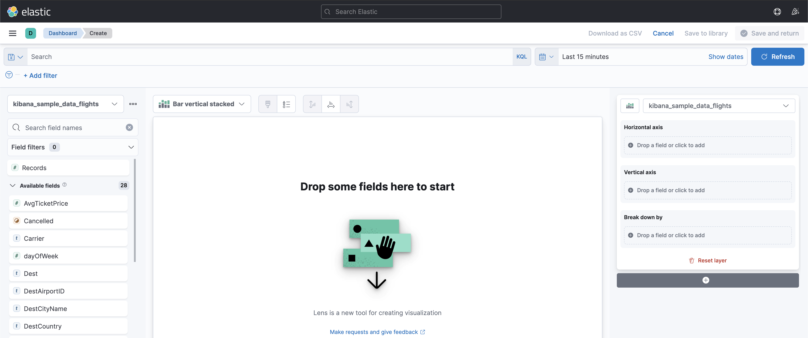

왼쪽의 Available field는 어떤 데이터를 가지고 시각화를 할지 정할 수 있는 필드 목록들입니다. 선택했다면 드래그해서 오른쪽으로 옮겨줍니다.


[그림13 - 시각화 형태 지정]


상단의 드롭박스를 클릭해보면 해당 필드를 가지고 어떤 형태로 시각화할지 정할 수 있습니다. 저는 Metric를 선택했습니다.


[그림14 - 시각화 옵션 선택]
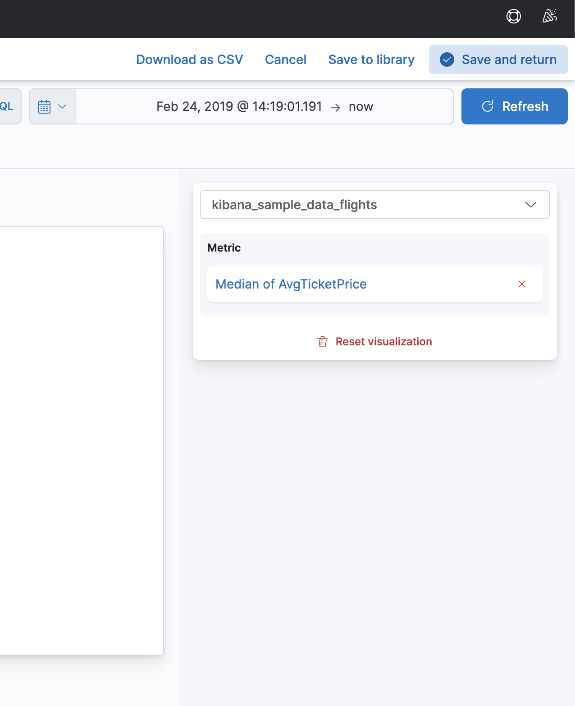

이제 화면의 가장 오른쪽을 보시면 Metric라고 있을 것입니다. Median of AvgTicketPrice를 클릭합니다.


[그림15 - 시각화 데이터 계산 방법 지정]


여기서는 이제 이 데이터를 가지고 어떤 계산을 할 것인지에 대해 정할 수 있습니다. 저는 Count를 선택하겠습니다.


[그림16 - 시각화 게시 기간 지정]


우측 상단에 보시면 기간을 선택할 수 있습니다. 적당한 기간을 선택한 뒤 Refresh를 하여 데이터의 양을 조절해줍니다. 그리고 상단의 Save and return을 클릭해줍니다.


[그림17 - 시각화 확인]


그럼 이렇게 만든 시각화 자료를 Dashboard에서 확인할 수 있습니다.

<br><br>

# 4. Logstash

## 4-1. Logstash란?

[그림18 - Logstash]


- 오픈 소스 서버측 데이터 처리 파이프 라인

- 다양한 소스에서 동시에 데이터를 수집하여 반환

- Input : Logstash로 데이터를 가져오는 작업으로 다음과 같은 대표적인 플러그인들이 있습니다.
    - file : UNIX 명령 -OF와 비슷하게 파일 시스템의 파일에서 읽음
    - syslog : RFC3164 형식에 따라 syslog 메시지 및 구문 분석을 위해 잘 알려진 포트 514를 수신
    - redis : redis 채털과 redis 목록을 모두 사용하여 redis 서버에서 읽음
    - beat : Filebeat에서 보낸 이벤트를 처리

- Filter : Logstash 파이프 라인의 중간 처리 장치로 다음과 같은 대표적인 플러그인들이 있습니다.
    - grok : 임의의 텍스트를 구성하고 현재 구조화되지 않은 로그 데이터를 구문 분석
    - mutate : 이벤트 필드에서 일반적인 변환을 수행합니다. 이벤트의 데이터 수정 및 제거
    - clone : 이벤트를 복사
    - geoip : ip주소의 지리적 위치에 대한 정보를 추가(키바나의 지도 차트로 사용)

- output : 최종 단계로 이벤트를 여러 출력으로 사용 가능
    - elasticsearch : Elasticsearch에 데이터를 전송, 데이터를 효율적이고 편리하며 쉽게 쿼리 형식으로 저장
    - file : 이벤트 데이터를 디스크의 파일로 저장
    - graphite : 이벤트 데이터를 Graphite에 전송, 이 데이터는 통계를 저장하고 그래프로 나타내기 위한 널리 사용되는 오픈 소스 도구
    - statsd : statsd에 이벤트 데이터를 전송, 카운터 및 타이머와 같은 통계를 수신하고 UDP를 통해 전송되며 하나 이상의 플러그 가능한 백엔드 서비스에 집계를 보내는 서비스

- Codes : 코덱은 기본적으로 입력 또는 출력의 일부로 작동할 수 있는 스트림 필터
    - json : JSON 형식의 데이터를 인코딩하거나 디코딩
    - multiline : 자바 예외 및 스택 추적 메시지와 같은 여러 줄 텍스트 이벤트를 단일 이벤트로 병합

<br>

## 4-2. Filebeat로 연동하기

EC2를 하나 만들어서 apache 웹서버를 띄우고 로그를 수집해보겠습니다.

```
#### 참고 사항 ####
## 설치된 위치 ## 
# Logstash
cd /usr/share/logstash
# Filebeat
cd /usr/share/filebeat

## 설정 파일 위치 ##
# Losgstash 
cd /etc/logstash 
# Filebeat 
cd /etc/filebeat

#### 참고사항 끝 ####

### 새로운 EC2에서 진행 ###
sudo apt-get update

# 새로운 EC2에 filebeat 설치
wget https://artifacts.elastic.co/downloads/beats/filebeat/filebeat-7.14.1-amd64.deb
sudo dpkg -i filebeat-7.14.1-amd64.deb

# apache2 설치
sudo apt-get install apache2

# Filebeat yml 수정
# filebeat는 기본적으로 output이 elasticsearch이기 때문에 logstash로 연결 수정이 필요함
cd /etc/filebeat
sudo vi filebeat.yml

#### yml 수정 ####
## log 부분에서 수정 진행 ##
#enable: false를 true로 수정
enable: true

path:
    - /var/log/apache2/*.log
## elaticsearch output은 전부 주석 처리 ##
# ---------------------------- Elasticsearch Output ----------------------------
#output.elasticsearch:
  # Array of hosts to connect to.
  # hosts: ["localhost:9200"]

  # Protocol - either `http` (default) or `https`.
  #protocol: "https"

  # Authentication credentials - either API key or username/password.
  #api_key: "id:api_key"
  #username: "elastic"
  #password: "changeme"

## logstash 주석 해제 ##
# ------------------------------ Logstash Output -------------------------------
output.logstash:
  # The Logstash hosts
  hosts: ["logstash의 Ip:5044"]

  # Optional SSL. By default is off.
  # List of root certificates for HTTPS server verifications
  #ssl.certificate_authorities: ["/etc/pki/root/ca.pem"]

  # Certificate for SSL client authentication
  #ssl.certificate: "/etc/pki/client/cert.pem"

  # Client Certificate Key
  #ssl.key: "/etc/pki/client/cert.key"

#### yml 수정 완료 ####

#### Logstash의 EC2로 이동해서 진행 ####
# Logstash config설정 
cd /etc/logstash/conf.d

## conf.d 폴더에 conf 파일을 배치하면 적용됩니다.##
# sample을 conf.d로 복사해서 진행해도 무관하지만 직접 작성하겠습니다.
# sudo cp logstash-sample.conf ./conf.d/first-pipeline.conf

sudo vi web.conf

input {
        beats{
                port => 5044
        }
}
filter {
        grok {
                match => { "message" => "%{COMBINEDAPACHELOG}" }
        }
        date {
                match => [ "timestamp" , "dd/MMM/yyy:HH:mm:ss Z" ]
        }
        geoip {
                source => "clientip"
        }
}
output {
        elasticsearch {
                hosts =>  [ "localhost:9200" ]
                index => "web-%{+YYYY.MM.dd}"
        }
}


sudo service logstash restart

## apache2 설치한 EC2에서 진행 ##
sudo service filebeat restart

curl 'localhost:80'
```

이렇게 진행하고 키바나에서 index를 등록하고 discover을 확인해보면 데이터가 잘 들어간 것을 확인할 수 있습니다.

<br><br>

# 5. docker compose로 구현하기

새로운 Ubuntu EC2에서 진행합니다.

```
sudo apt-get update
sudo apt-get upgrade -y

# docker 설치
sudo apt install docker.io -y
docker -v

## docker ps 입력해보고 permission denied 가 나올 경우 아래 명령어 사용 ##
sudo chmod 666 /var/run/docker.sock

# docker compose 설치 
# 최신버전은 https://github.com/docker/compose/releases 참고 -> uri의 버전만 수정하면 됩니다.
sudo curl -L "https://github.com/docker/compose/releases/download/1.29.2/docker-compose-$(uname -s)-$(uname -m)" -o /usr/local/bin/docker-compose
sudo chmod +x /usr/local/bin/docker-compose
sudo ln -s /usr/local/bin/docker-compose /usr/bin/docker-compose
docker-compose -v


# elastic docker 문서
# https://www.elastic.co/guide/en/elastic-stack-get-started/current/get-started-docker.html
vi docker-compose.yml

### 입력 시작 ###
version: '2.2'
services:
  es01:
    image: docker.elastic.co/elasticsearch/elasticsearch:7.14.1
    container_name: es01
    environment:
      - node.name=es01
      - cluster.name=es-docker-cluster
      - discovery.seed_hosts=es02,es03
      - cluster.initial_master_nodes=es01,es02,es03
      - bootstrap.memory_lock=true
      - "ES_JAVA_OPTS=-Xms512m -Xmx512m"
    ulimits:
      memlock:
        soft: -1
        hard: -1
    volumes:
      - data01:/usr/share/elasticsearch/data
    ports:
      - 9200:9200
    networks:
      - elastic

  es02:
    image: docker.elastic.co/elasticsearch/elasticsearch:7.14.1
    container_name: es02
    environment:
      - node.name=es02
      - cluster.name=es-docker-cluster
      - discovery.seed_hosts=es01,es03
      - cluster.initial_master_nodes=es01,es02,es03
      - bootstrap.memory_lock=true
      - "ES_JAVA_OPTS=-Xms512m -Xmx512m"
    ulimits:
      memlock:
        soft: -1
        hard: -1
    volumes:
      - data02:/usr/share/elasticsearch/data
    networks:
      - elastic

  es03:
    image: docker.elastic.co/elasticsearch/elasticsearch:7.14.1
    container_name: es03
    environment:
      - node.name=es03
      - cluster.name=es-docker-cluster
      - discovery.seed_hosts=es01,es02
      - cluster.initial_master_nodes=es01,es02,es03
      - bootstrap.memory_lock=true
      - "ES_JAVA_OPTS=-Xms512m -Xmx512m"
    ulimits:
      memlock:
        soft: -1
        hard: -1
    volumes:
      - data03:/usr/share/elasticsearch/data
    networks:
      - elastic

  kib01:
    image: docker.elastic.co/kibana/kibana:7.14.1
    container_name: kib01
    ports:
      - 5601:5601
    environment:
      ELASTICSEARCH_URL: http://es01:9200
      ELASTICSEARCH_HOSTS: '["http://es01:9200","http://es02:9200","http://es03:9200"]'
    networks:
      - elastic

volumes:
  data01:
    driver: local
  data02:
    driver: local
  data03:
    driver: local

networks:
  elastic:
    driver: bridge

### 입력 종료 ###

## docker의 세팅되어있는 VM 메모리 양을 늘려야합니다. ##
# 현재 vm 메모리양
sudo sysctl -a | grep vm.max
# 수정
sudo sysctl -w vm.max_map_count=262144
# 영구적으로 수정
sudo vi /etc/sysctl.conf
# 최하단에 삽입
vm.max_map_count = 262144
# 적용
sudo sysctl -p

# 도커 컴포즈 실행
docker-compose up -d

# 만약 ELK 설정을 수정하고 싶다면 아래 명령어로 접속해서 설정파일을 수정하면 됩니다.
docker -it 컨테이너명 bash 
```

<br><br>

6. logstash에 여러 conf 지정하기

앞서 apache 로그를 수집하여 ELK로 연동해보았습니다. 이번에는 AWS의 로드밸런서의 로그 수집과 spring 부트의 log수집을 동시에 진행해보겠습니다.

<br>

## 6-1. AWS 로드밸런서 로그 수집하기

[그림19 - AWS 로드밸랜서 로그 수집]


AWS 로드밸런서는 S3통해 로그 수집이 가능합니다. S3 버킷을 이름만 설정하고 기본 설정 그대로 만들어 줍니다. 해당 버킷의 권합 탭에서 버킷 정책을 다음과 같이 입력하고 적용합니다. Resourece 부분의 gjgs-lb-log 부분만 각자의 버킷명으로 수정하면 됩니다.

```
{
    "Version": "2012-10-17",
    "Id": "Policy1631090429789",
    "Statement": [
        {
            "Sid": "Stmt1631090428337",
            "Effect": "Allow",
            "Principal": {
                "AWS": "arn:aws:iam::600734575887:root"
            },
            "Action": "s3:PutObject",
            "Resource": "arn:aws:s3:::gjgs-lb-log/*"
        }
    ]
}
```

[그림20 - S3 위치 등록]
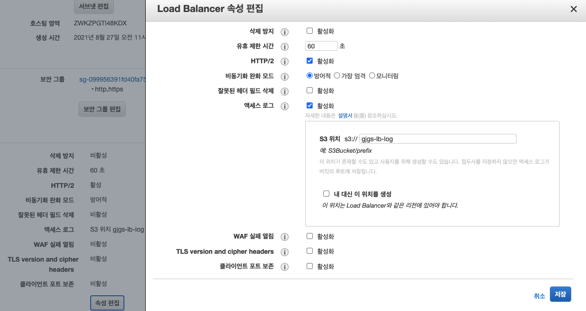

로그를 수집할 로드밸런서를 선택하고 하단의 속성 편집 탭을 클릭합니다. 액세스 로그를 활성화하고 만들어둔 S3 위치를 입력하고 등록합니다. 이렇게 설정을 마치면 5분마다 로드밸런서의 로그가 버킷으로 수집됩니다.

<br>

## 5-2. Logstash conf 파일

2가지의 로그를 수집할 것이므로 conf 파일을 2개 만들겠습니다. conf.d 에 conf 파일을 만들어 두면 실행 시 conf 파일들이 하나의 conf 파일로 결합되어 적용됩니다.

```
cd /etc/logstash/conf.d

# 스프링 로그 수집 설정
# 스프링 로그 형태 
# [%d{yyyy-MM-dd HH:mm:ss}][%-5level][%logger.%method:line%line] - %msg%n
sudo vi web.conf
input {
        beats {
                port => 5044
                type => "spring"
        }
}

filter {
        if [type] == "spring" {
                dissect {
                        mapping => {"message" => "[%{timestamp}][%{level}][%{method}] - %{message}"}
                }
                date {
                        match => ["timestamp", "yyyy-MM-dd HH:mm:ss" ]
                        target => "@timestamp"
                        timezone => "Asia/Seoul"
                        locale => "ko"
                }
        }
}

output {
        if [type] == "spring" {
                elasticsearch {
                        hosts => [ "localhost:9200" ]
                        index => "spring-%{+YYYY.MM.dd}"
                }
        }
}

# 로드 밸런서 로그 수집 설정
sudo vi elb.conf
input {
        s3 {
                access_key_id => "iam 액세스 id"
                secret_access_key => "iam 비밀 키"
                bucket => "버킷명"
                prefix => "버킷 prefix" # ex) AWSLogs/124124/elasticloadbalancing/ap-northeast-2/
                region => "ap-northeast-2"
                type => "elb-logs"
                additional_settings => {
                        force_path_style => true
                        follow_redirects => false
                }

        }
}

filter {
      if [type] == "elb-logs" {
          grok {
              match => [ "message", '%{NOTSPACE:request_type} %{TIMESTAMP_ISO8601:log_timestamp} %{NOTSPACE:alb-name} %{NOTSPACE:client} %{NOTSPACE:target} %{NOTSPACE:request_processing_time:float} %{NOTSPACE:target_processing_time:float} %{NOTSPACE:response_processing_time:float} %{NOTSPACE:elb_status_code} %{NOTSPACE:target_status_code:int} %{NOTSPACE:received_bytes:float} %{NOTSPACE:sent_bytes:float} %{QUOTEDSTRING:request} %{QUOTEDSTRING:user_agent} %{NOTSPACE:ssl_cipher} %{NOTSPACE:ssl_protocol} %{NOTSPACE:target_group_arn} %{QUOTEDSTRING:trace_id} "%{DATA:domain_name}" "%{DATA:chosen_cert_arn}" %{NUMBER:matched_rule_priority:int} %{TIMESTAMP_ISO8601:request_creation_time} "%{DATA:actions_executed}" "%{DATA:redirect_url}" "%{DATA:error_reason}"']
          }
          date {
              match => [ "log_timestamp", "ISO8601" ]
          }
          mutate {
              gsub => [
                  "request", '"', "",
                  "trace_id", '"', "",
                  "user_agent", '"', ""
              ]
          }
          if [request] {
              grok {
                  match => ["request", "(%{NOTSPACE:http_method})? (%{NOTSPACE:http_uri})? (%{NOTSPACE:http_version})?"]
              }
          }
          if [http_uri] {
              grok {
                  match => ["http_uri", "(%{WORD:protocol})?(://)?(%{IPORHOST:domain})?(:)?(%{INT:http_port})?(%{GREEDYDATA:request_uri})?"]
              }
          }
          if [client] {
              grok {
                  match => ["client", "(%{IPORHOST:c_ip})?"]
              }
          }
          if [target_group_arn] {
              grok {
                  match => [ "target_group_arn", "arn:aws:%{NOTSPACE:tg-arn_type}:%{NOTSPACE:tg-arn_region}:%{NOTSPACE:tg-arn_aws_account_id}:targetgroup\/%{NOTSPACE:tg-arn_target_group_name}\/%{NOTSPACE:tg-arn_target_group_id}" ]
              }
          }
          if [c_ip] {
              geoip {
                  source => "c_ip"
                  target => "geoip"
              }
          }
          if [user_agent] {
              useragent {
                  source => "user_agent"
                  prefix => "ua_"
              }
          }
      }
}

output {
        if [type] == "elb-logs" {
                elasticsearch {
                        hosts => [ "localhost:9200" ]
                        index => "elb-log-%{+YYYY.MM.dd}"
                }
        }
}

# logstash 시작
sudo service logstash start

# logstash 로그 확인
vi /var/log/logstash/logstash-plain.log
```


[그림21 - 엘라스틱서치]
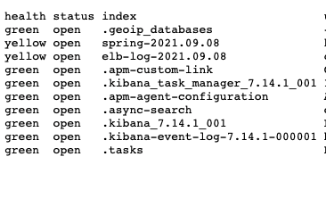

엘라스틱서치ip:9200/_cat/indices?v 를 검색해보면 spring 로그와 elb 로그가 잘 들어와 있는 것을 확인할 수 있습니다. 저는 바로바로 보이지가 않았는데 키바나의 devtools에서 아래와 같이 search를 해보니 정상적으로 들어와있는 것을 확인할 수 있었습니다. 이렇게 검색을 하고 다시 cat으로 보니 잘 들어와 있었습니다.

```
GET spring-2021.09.08/_search
{
  "query": {
    "match_all": {}
  }
}

GET elb-log-2021.09.08/_search
{
  "query": {
    "match_all": {}
  }
}
```

<br>

## 5-3. 스프링 로그 시간 참고사항

위의 스프링 로그 수집 과정에서 logstash conf에 다음과 같은 코드가 있습니다.

```
date {
        match => ["timestamp", "yyyy-MM-dd HH:mm:ss" ]
        target => "@timestamp"
        timezone => "Asia/Seoul"
        locale => "ko"
}
```

저는 spring 로그가 찍힐 때 한국 시간으로 찍히도록 설정을 해두고 로그 파일을 만들었습니다. 즉, 데이터의 원본 날짜가 한국 시간입니다. Logstash의 Date 필터는 원본 날짜 데이터를 Timezone, Locale 파라미터를 사용하여 분석하고 이를 ElasticSearch에 전달하면 UTC 기준으로 날짜 데이터가 저장됩니다. 따라서 한국 시간인 것을 명시해줍니다. 기본적으로 logstash의 @timestamp는 logstash가 데이터를 읽은 시간으로 저장되는데 date 필터를 사용하여 target을 @timestamp를 주면 로그가 실제 생성된 시간으로 @timestamp를 지정할 수 있습니다. target은 default값이 @timestamp이므로 생략이 가능합니다.

<br>

## 5-4. 키바나 TimeZone 세팅

[그림22 - 키바나 TimeZone 세팅]


키바나 왼쪽 탭 최하단 Stack Management -> 왼쪽 탭에서 Advanced Settings 에서 키바나에 보이는 데이터의 타임존을 설정할 수 있습니다. 기본 세팅은 Browser 로서, 현재 사용하는 브라우저의 타임존을 감지하여 적용해줍니다.

<br>

## 5-5. 로그 수집 바탕으로 DashBoard 구성

[그림23 - 로그 수집 바탕으로 DashBoard 구성]


spring에서 수집한 error 로그로 count, method, ip에 대한 그래프와, 로드밸런서에서 수집한 count, client_ip, port에 대한 그래프를 구성해보았습니다.